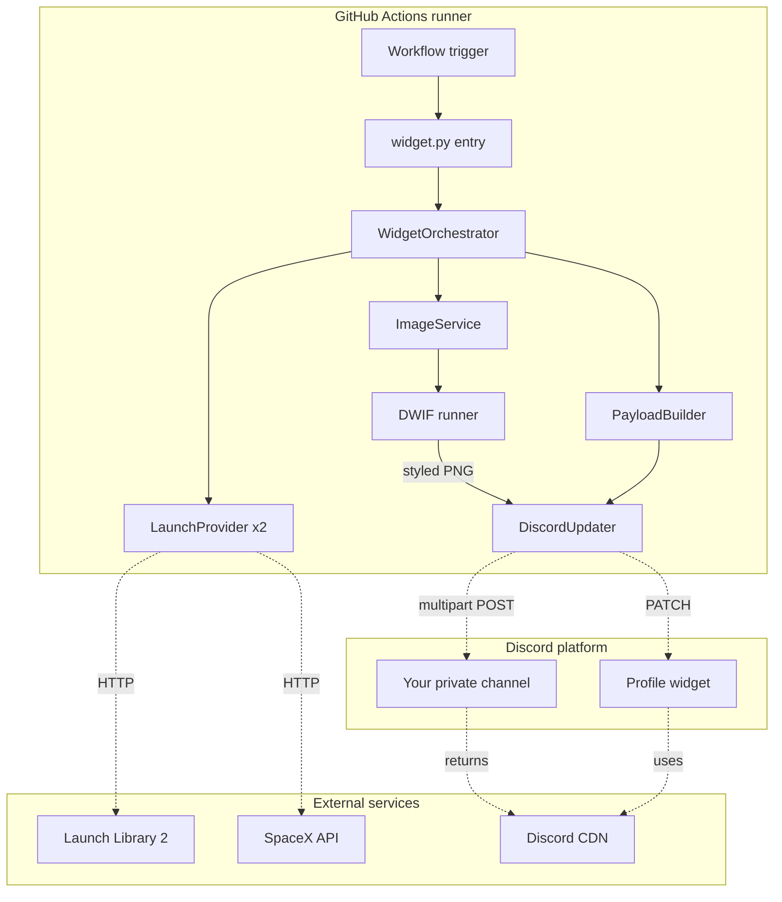
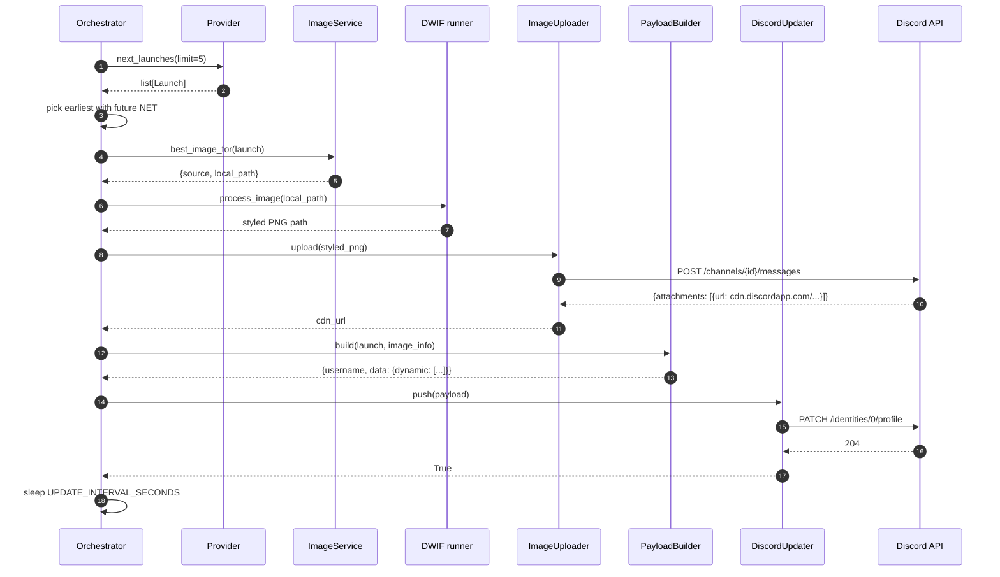
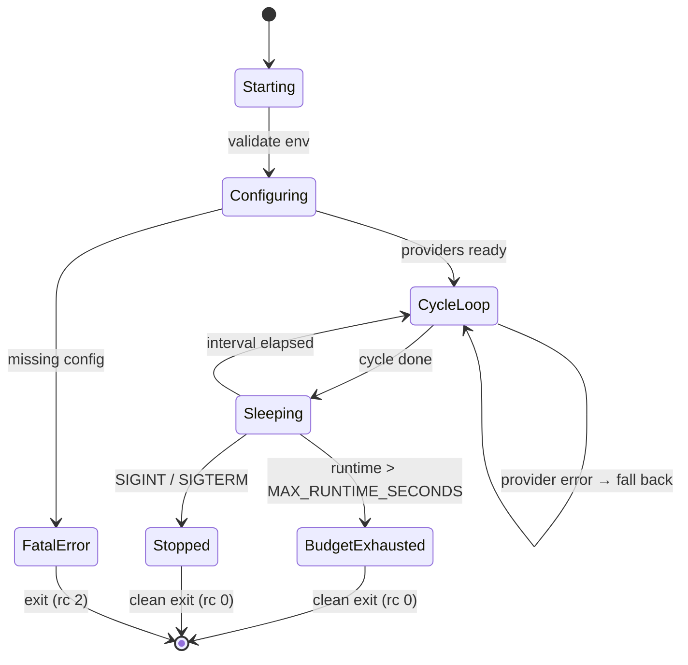
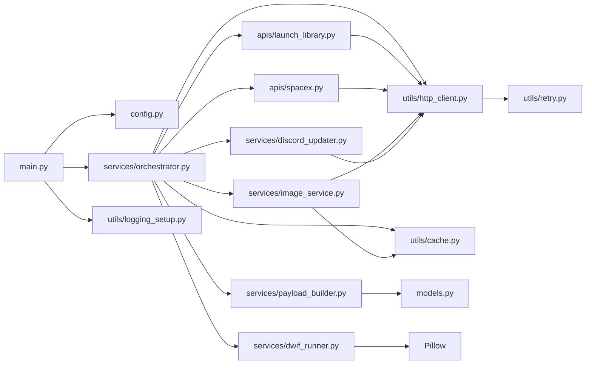
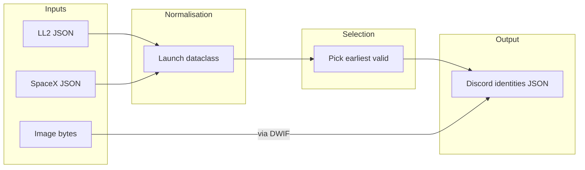

# Architecture

This document describes the runtime architecture, request lifecycle,
and module-level design of the Discord LaunchPad Widget daemon.

## High-level overview



## Request lifecycle

A single daemon cycle has these stages:



## Concurrency model

The daemon is single-threaded. All API calls and image processing are
sequential. This is intentional:

- Discord's PATCH endpoint is rate-limited (~3 per bucket); concurrent
  PATCHes would burn the budget faster.
- Image processing is sub-second per image; no need for parallelism.
- The cycle interval (default 5 min) is the throughput ceiling.

If higher throughput is ever needed, the orchestrator's `cycle()` can
be wrapped in a `concurrent.futures.ThreadPoolExecutor` since the only
blocking calls (HTTP) are I/O-bound.

## Lifecycle of a daemon run



## Module dependencies



## Data flow



## Error handling strategy

| Failure | Behaviour |
| --- | --- |
| LL2 unreachable | Try SpaceX provider instead |
| Both providers fail | Log warning, skip cycle, retry next tick |
| No image for launch | Use bundled fallback image |
| D.W.I.F fails | Log warning, use raw image |
| Image upload 401 | Retry once after 2s (transient Discord rate limit) |
| Image upload 403 | Skip image, still PATCH text fields |
| PATCH 429 | Honour `Retry-After`, raise to caller |
| PATCH 4xx | Log error, continue to next cycle |
| PATCH 5xx | Retry with backoff |
| Workflow runner SIGKILL'd | 6h `schedule:` cron re-runs the workflow |

## File system layout

```
/home/runner/work/.../             <- GitHub Actions checkout
├── widget.py                       <- entry point
├── launchpad_widget/               <- package
│   ├── main.py                     <- package entry
│   ├── config.py                   <- env / config.json loading
│   ├── models.py                   <- dataclasses (Launch, CrewMember)
│   ├── apis/
│   │   ├── base.py                 <- LaunchProvider Protocol
│   │   ├── launch_library.py        <- LL2 client + parser
│   │   └── spacex.py               <- r-spacex client + parser
│   ├── services/
│   │   ├── image_service.py        <- image picker + cache
│   │   ├── dwif_runner.py          <- D.W.I.F image styling
│   │   ├── payload_builder.py       <- Launch → Discord JSON
│   │   ├── discord_updater.py      <- PATCH + state dedup
│   │   └── orchestrator.py         <- main loop
│   ├── utils/
│   │   ├── http_client.py          <- requests wrapper + retry
│   │   ├── cache.py                <- TTL caches (API + image)
│   │   ├── retry.py                <- generic backoff helper
│   │   └── logging_setup.py        <- rotating file + console
│   └── assets/
│       └── fallback.png             <- bundled fallback image
├── cache/                          <- runtime artefacts (gitignored)
│   ├── launches.json               <- API response cache
│   ├── last_payload.json           <- dedup state
│   └── images/                     <- downloaded launch images
├── dwif/                           <- D.W.I.F install (gitignored, optional)
├── config.json                     <- local override (gitignored)
├── widget.log                      <- runtime log (gitignored)
└── .github/workflows/update.yml    <- CI daemon
```

The `cache/` and `dwif/` directories are not committed — they're
runtime artefacts that are regenerated on each run.
