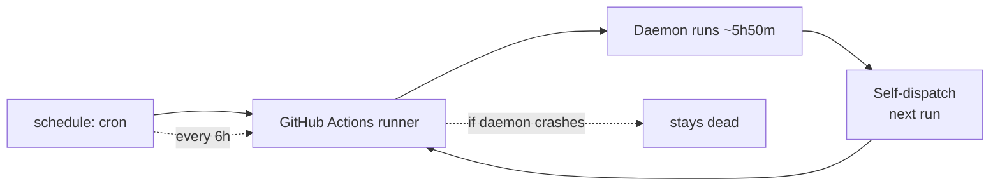

# Hosting on GitHub Actions

This project is designed to run as a long-lived **cloud daemon** inside
a GitHub Actions workflow. There is no VPS, no local machine, no Docker.

## How it works



The daemon runs in a loop, PATCHing the widget every
`UPDATE_INTERVAL_SECONDS` (default 5 minutes). When it approaches
GitHub's 6-hour hard cap, it returns cleanly so the workflow can
self-dispatch a new run.

## Why this design

GitHub-hosted runners have a hard 6-hour (360 min) timeout. Our
`MAX_RUNTIME_SECONDS` default is 21000s (~5h50m) which gives the loop
time to notice, log a clean shutdown, and `return` on its own terms
instead of being SIGKILLed mid-request with a dangling PATCH.

## Concurrency

```yaml
concurrency:
  group: launchpad-widget-daemon
  cancel-in-progress: false
```

Only one live updater at a time. If a second trigger (e.g. the cron
firing while the self-dispatched run is still up) tries to start, it
**queues** rather than killing the live daemon. `cancel-in-progress:
false` is intentional because the live daemon is making progress that
shouldn't be interrupted.

## Self-trigger

```yaml
- name: Trigger next run
  if: success()
  run: |
    curl -sS -f -X POST \
      -H "Authorization: token ${{ secrets.GITHUB_TOKEN }}" \
      -H "Accept: application/vnd.github+json" \
      https://api.github.com/repos/${{ github.repository }}/actions/workflows/update.yml/dispatches \
      -d '{"ref":"${{ github.ref_name }}"}'
    echo "Next run queued."
```

The `if: success()` condition means this step only runs when the daemon
exits with a non-error code (0). On a crash, no follow-up is queued —
the 6h `schedule:` cron acts as the safety net.

## The 6h schedule cron

```yaml
schedule:
  - cron: "0 */6 * * *"
```

A safety net that fires every 6 hours. If the self-trigger fails for
any reason, this keeps the widget from going stale. GitHub's cron is
best-effort and can be delayed by up to ~30 min during busy periods.

## How long does it actually take to start?

The first run of the workflow:
- ~20s: checkout + Python setup
- ~5s: `pip install requests Pillow`
- ~1-2s: launch data fetch
- ~2-5s: image download + D.W.I.F styling
- ~1s: Discord upload + PATCH
- **Total: ~30-40s** for the first PATCH

Subsequent runs reuse the GitHub Actions cache, so they finish in
~20-25s.

## Tweakables

The workflow accepts these GitHub Variables (Settings → Secrets and
variables → Actions → Variables tab). Variables are non-sensitive
tunables, not encrypted like Secrets.

| Variable | Default | Purpose |
| --- | --- | --- |
| `UPDATE_INTERVAL_SECONDS` | `300` | Time between cycles |
| `MIN_PATCH_INTERVAL_SECONDS` | `60` | Throttle for Discord PATCHes |
| `MAX_RUNTIME_SECONDS` | `21000` | Soft runtime budget |
| `PREFERRED_SOURCE` | `launch_library` | `launch_library` or `spacex` |
| `CACHE_TTL_SECONDS` | `120` | API response cache TTL |
| `DRY_RUN` | `false` | Log-only mode (don't PATCH) |

## Costs

GitHub-hosted runners (free for public repos):
- **2,000 minutes/month** for free
- ~5h50m × 4 runs/day × 30 days = **350 min/month**
- Plenty of headroom

For private repos: 2,000 min/month is split across all private repos
on the account.

## Local development

```bash
git clone https://github.com/MeYashverma/Discord-LaunchPad-Widget.git
cd Discord-LaunchPad-Widget
pip install -r requirements.txt
cp config.example.json config.json
# edit config.json with your Discord creds
DRY_RUN=true python widget.py
```

`DRY_RUN=true` logs the payload without PATCHing Discord. Set it to
`false` (or remove the env var) to actually update your widget.

## Why not a serverless function or cron job?

We tried. Serverless functions are too short-lived to keep a daemon
loop. Plain cron jobs work but mean each cycle is a cold start (no
in-memory state, no cached images).

The GitHub Actions daemon pattern gives us:
- ✅ Persistent in-memory state (cache, image downloads)
- ✅ Self-restart with no manual intervention
- ✅ Zero infrastructure to manage
- ✅ Free for public repos
- ✅ Easy to fork + customize
