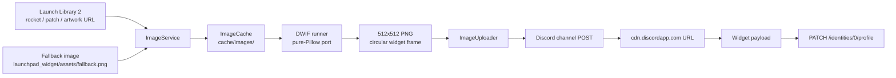

# Image Processing Pipeline

This document describes the full path an image takes from the upstream
launch data source to the final Discord widget render.

## Overview



## Step 1 — Pick the best image

`ImageService.best_image_for(launch)` walks the `image_priority` list
and returns the first non-empty URL. The default priority is:

1. `rocket` — `Launch.rocket_image_url` (e.g. Falcon 9 silhouette)
2. `mission_patch` — `Launch.mission_patch_url` (mission insignia)
3. `launch_artwork` — `Launch.launch_artwork_url` (official launch poster)
4. `launchpad` — `Launch.launchpad_image_url` (pad photo)
5. **fallback** — the bundled `launchpad_widget/assets/fallback.png`

Each priority name maps to a dataclass field via the `_attr_map` in
`ImageService`. You can also use the full field names (e.g.
`rocket_image_url`) directly in config.

## Step 2 — Download and cache

`ImageService._download(url)`:

1. Hashes the URL (SHA-256, first 16 hex chars) to produce a stable
   cache key
2. Checks the `ImageCache` (file-backed, TTL-based) for a fresh entry
3. If miss, downloads via `HttpClient.get_bytes`
4. Rejects images >5 MB (Discord's upload limit)
5. Stores the bytes in `cache/images/img_{hash}.bin`
6. Returns the local path

`ImageCache` is a JSON-indexed file cache with per-key TTL. Default
TTL for images is 24 hours (`IMAGE_CACHE_TTL_SECONDS`).

## Step 3 — D.W.I.F image styling

`dwif_runner.process_image(local_path, target_size=512)` applies the
D.W.I.F transform to make the image fit Discord's circular widget
clip.

### Algorithm

1. **Center-crop to 512×512** using `PIL.ImageOps.fit()` (Lanczos resampling)
2. **Add a transparent top strip** (~17-18px at 512px) so the title can
   overlay cleanly
3. **Round the top-right corner** (~36-40px at 512px) so the image
   matches Discord's circular clip path

The top strip and corner radius are calculated using D.W.I.F's
calibration math:

```python
_STRIP_BASE = 17      # pixels at 512px reference
_RADIUS_BASE = 36     # pixels at 512px reference
_STRIP_EXP = log(54 / 17) / log(sqrt(1844 * 853) / 512)
_RADIUS_EXP = log(172 / 36) / log(sqrt(1844 * 853) / 512)

def _auto(base, exponent, size):
    return round(base * (size / 512) ** exponent)
```

The math is calibrated against 512×512 reference images. At larger
sizes the values grow proportionally.

### The mask

The corner rounding uses an alpha-channel mask:

```python
# White everywhere
mask = Image.new("L", (w, h), 255)
# Clear the corner box
md.rectangle([w - radius, top_strip, w, top_strip + radius], fill=0)
# Restore the quarter-circle that the widget shows
cx, cy = w - radius, top_strip + radius
md.ellipse([cx - radius, cy - radius, cx + radius, cy + radius], fill=255)
# Apply the mask to the alpha channel
canvas = Image.merge("RGBA", (r, g, b, ImageChops.multiply(a, mask)))
```

This creates a perfectly circular frame at the top of the image that
matches Discord's widget clip.

### Reference implementation

The D.W.I.F algorithm was originally written in Node.js with `sharp`
by [AjaxFNC-YT](https://github.com/AjaxFNC-YT/D.W.I.F). This project
ports the algorithm to pure Python via Pillow so:

- No Node.js dependency
- No `npm install` step in the GitHub Actions workflow
- Faster cold starts
- Same output (the math is preserved exactly)

The port was inspired by the `fix_widget_image()` function in
[Discord-Lyrically-Widget](https://github.com/MeYashverma/Discord-Lyrically-Widget)
which does the same thing independently.

## Step 4 — Upload to Discord

`ImageUploader.upload(local_path)`:

1. Opens a multipart POST to `https://discord.com/api/v9/channels/{id}/messages`
2. Attaches the file as `files[0]`
3. Discord responds with a message object including the attachment
   metadata
4. We extract `attachments[0].url` which is a `cdn.discordapp.com` URL
5. This URL is valid forever (until the message is deleted) and serves
   the image at native size

The upload uses a Discord bot token with `Send Messages` and
`Attach Files` permissions in the target channel.

## Step 5 — Inject into the widget payload

The CDN URL flows into the payload builder:

```python
image_info = {
    "url": "https://launch_artwork_url.png",
    "source": "launch_artwork",
    "local_path": "/cache/images/img_abc.bin",
    "cdn_url": "https://cdn.discordapp.com/.../img.png-dwif.png"  # set after upload
}
```

`PayloadBuilder._image_field(image_info)` picks the `cdn_url` first,
then any `https_url`, and produces a Discord `type: 3` field:

```python
{
    "name": "Image",
    "type": 3,
    "value": {"url": "https://cdn.discordapp.com/.../img.png-dwif.png"}
}
```

Both the top `Image` field and the bottom `image` field receive the
same URL.

## Step 6 — Discord renders

When Discord receives the PATCH, it stores the URL. On profile
renders, Discord downloads the URL once and caches it. The image is
then composited into the widget's circular clip path.

The widget always uses Discord's native clipping, so the image we
upload doesn't need to be pre-clipped — our transparent corners
just ensure the **artwork** sits properly inside the clip, not
that the image itself is clipped.

## Failure modes

| Failure | Behaviour |
| --- | --- |
| Image URL 404 | ImageService tries the next priority |
| All priorities fail | Use bundled fallback image |
| Download timeout | ImageService tries the next priority |
| Pillow not installed | Raw image uploaded (no D.W.I.F styling) |
| D.W.I.F processing error | Raw image uploaded (log warning) |
| Image >5MB | ImageService tries the next priority |
| Image upload 403 | Skip image, still PATCH text fields |
| Image upload 401 | Retry once after 2s |
| Image upload 429 | Honour Retry-After |
| No image and no fallback | Send `value: {"url": ""}` |

## Customisation

### Change the output size

Edit `WIDGET_IMAGE_SIZE` in `services/dwif_runner.py`:

```python
WIDGET_IMAGE_SIZE = 1024  # or 256, 768, etc.
```

The D.W.I.F math will auto-scale the top strip and corner radius.
Discord will scale the image to fit its 650×650 base widget canvas
regardless of upload size.

### Use a different image priority

Set `IMAGE_PRIORITY` as a GitHub Variable (comma-separated):

```
IMAGE_PRIORITY=launch_artwork,mission_patch,rocket,launchpad
```

Or in `config.json`:

```json
{
  "image_priority": ["launch_artwork", "mission_patch", "rocket", "launchpad"]
}
```

### Use the optional Node.js D.W.I.F

If for some reason you want the original Node.js D.W.I.F subprocess
instead of the Pillow port:

```bash
DWIF_USE_NODE=1 pip install ...
```

The Node path is kept for backwards compatibility but is no longer
the default (and is not exercised in the workflow).
